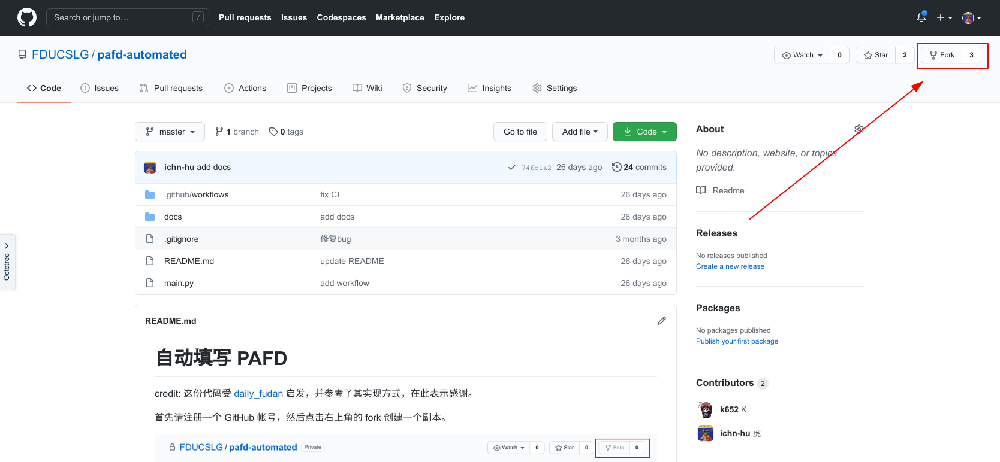
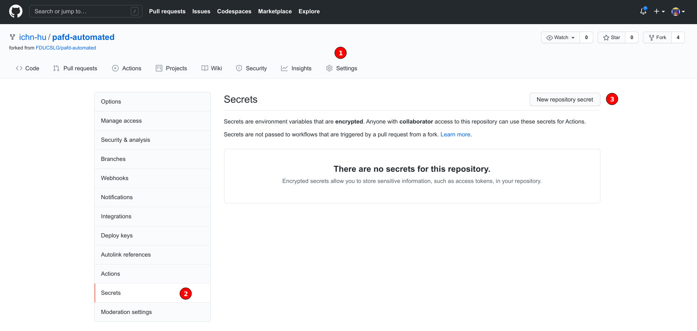
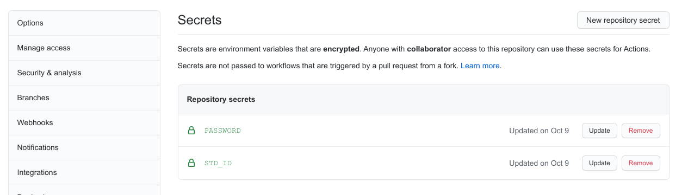

# 如何自动填写 PAFD！

如果你受够了每天都忘记填 PAFD 带来的痛（kuai）苦（le）

如果你再也不想为 PAFD 而烦恼

如果你希望每天都能填 PAFD

那么你来对地方了！

我们开源了一个[自动填写 PAFD 的机器人](https://github.com/FDUCSLG/pafd-automated)，只需要你按照本文步骤完成操作，你就可以免费拥有它！

这个机器人可以在每天 10 点的时候自动登录 PAFD 并使用你上次填写时的位置自动上报，而所有你需要做的，只不过是动动鼠标完成配置~

心动的话请继续看下去~

## 步骤一：注册 GitHub 帐号

如果你还没有 GitHub 帐号，那么首先请先注册一个。

点击 [Join GitHub](https://github.com/join) 注册，填入用户名、邮箱和密码即可。

注意，如果你的网络环境不够好，在电脑上注册可能刷不出验证码，那么你可以尝试在手机浏览器中打开上述链接注册[^1]，或者多试几次。

!!! note
    如果你遇到了注册上的问题，欢迎到我们的 slack 频道中提问！使用学号邮箱点击 [https://join.slack.com/t/fducslg/signup](https://join.slack.com/t/fducslg/signup) 注册即可！

[^1]: [GitHub注册失败，卡在第一步](https://m.yisu.com/zixun/96667.html)

## 步骤二：fork 机器人代码

GitHub 是一个代码托管平台，我们的开源 PAFD 机器人也托管在 GitHub 上。

点击 [pafd-automated](https://github.com/FDUCSLG/pafd-automated) 打开我们的 PAFD 机器人代码仓库，然后点击右上角的 **fork** 按钮。

然后你就会发现，在你自己的帐号下也出现了一个一样的代码仓库，这就是你 fork 出来的、属于你的代码仓库。

然后点击上图提示的 **Settings** 进入设置页面。

然后我们来添加账户信息，用于 PAFD 打卡。点击 **Secrets** 然后点击 **New repository secret**，然后分别添加名为 `STD_ID` 和 `PASSWORD` 的两个秘密。

Name 为 `STD_ID` 的在 Value 里填入学号

Name 为 `PASSWORD` 的在 Value 里填入 UIS 密码（即学号密码）。这里可以不用担心安全性问题，在你 fork 的代码仓库下，这些密码只有你可以看到，其他任何人都不行[^2]。因为背后是 GitHub 为你保障安全，作为世界上最大规模的程序托管平台，其安全性值得信赖。

[^2]: 实际上你自己也只有在填写的时候能看到内容，填写完成后，你也无法看到具体内容了

添加完成后可以看到

## 步骤三：躺着等机器人自动帮你填 PAFD！

通过 GitHub Action[^3]，每天十点会自动运行脚本帮你填写 PAFD，填写的地址是上一次的位置，从而你再也不用担心被辅导员催啦~

如果你按耐不住，想手动触发自动填写，可以来到 action 页面

然后按照图示的顺序点击自动触发 workflow，如果你上述配置是正确的，那么你就可以期待自动填写成功啦[^4]！

如果你在这个过程中遇到任何问题，都欢迎来我们的 slack 群组中询问~使用学号邮箱点击 [https://join.slack.com/t/fducslg/signup](https://join.slack.com/t/fducslg/signup) 注册即可！

如果你的网络条件足够好，你也可以在本页面下方看到一个评论区，你可以使用 GitHub 帐号进行评论~

最后

[^4]: 前提是你点击触发的当天还没有手动填过 PAFD

[^3]: GitHub Action 是 GitHub 推出的一款服务，可以做到定时运行脚本，本机器人所使用的 action 代码可见[此](https://github.com/FDUCSLG/pafd-automated/blob/master/.github/workflows/automate.yml)，建议你可以尝试修改自动填写的时间，从 10 点改到 11 点或者任何一个时间，避免所有人都在十点填写，对学校 PAFD 服务器造成过大压力。改写方法为，进入你 fork 的代码仓库，找到 `pafd-automated/.github/workflows/automate.yml` 文件，然后点击代码右上角的铅笔符号，修改文件，然后把 `cron: '0 2 * * *'` 中的 `2` 改成 其他 24 以内的数字（注意这里的 2 表示 UTC 2 a.m.，即北京时间 10 点，如果你改成 3 ，则自动触发时间就是北京时间 11 点）