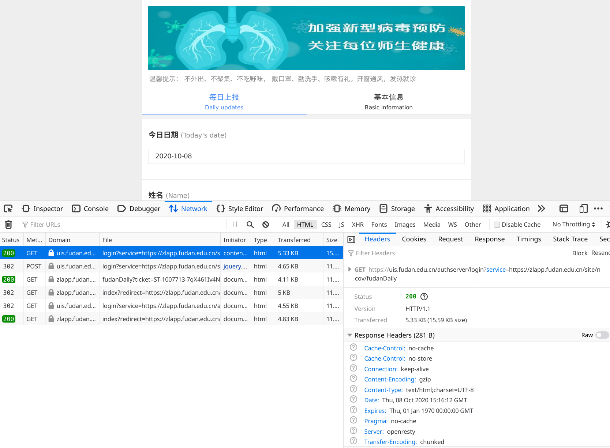

# 自动填写 PAFD 的技术原理

Hi 大家好~这是 CSLG 的第一次技术分享，也是第一篇技术向的博客，希望能让大家学习自动填写 PAFD 的原理。

## HTTP 协议机制

首先需要介绍的是 PAFD 的填写背后的机制。

大家应该都习惯了互联网，但是否知道互联网是怎么工作的呢？

我们日常使用的网络通信本质上就是一个客户端到服务端的通信。这里的客户端（client）可以是我们的手机应用、浏览器等等，而服务端（server）则是各种各样的网络服务提供者的服务器。

客户端和服务端间的通信通常使用的是 HTTP 协议（或者更安全的 HTTPS，这里我们不多谈）。一次通信过程是由客户端向服务端发起 Request，然后服务端返回一个 Response 结束。

而通信的内容则是由文本构成的，主要分为 Header 和 Body 两个部分。

Request Header 描述了这次通信的一些规定，比如说

- Host：即向谁发起请求
- User-Agent：请求由什么样的设备发起，譬如是手机浏览器还是电脑浏览器
- Cookie：告诉服务端自己手上的 Cookie（具体关于 Cookie 的解释可以见下文）
- Content-Type：Body 的格式，通常有表单（form）和 JSON 两种

Response Header 则通常包括

- Set-Cookie：请客户端设置 Cookie
- Content-Type：返回的 Response 中的 Body 的格式，通常是 `text/html` 或者 JSON

而 Body 则是一次通信中最主要的内容。Request 的 Body 通常包含请求的参数，比如登录的 Reqest 就会包含用户名和密码，而 Response 的 Body 则通常包含网页的代码（HTML）和数据等等。

我们填写 PAFD 的时候，本质上就是我们的浏览器作为客户端代替我们向服务端发起登录、填写的请求，而如果我们可以用代码来完成这一通信过程，我们就不需要手动操作了。

所以我们要做的第一步就是知道浏览器去访问服务器时，他们之间究竟说了些什么。

## 通过调试页面观测 HTTP 请求

为此我们需要观测登录、填写时的 http 请求。

推荐使用 firefox 浏览器，按 F12 进入调试页面，然后选择 Network 并且点击 Persist Log 方便观察网络请求的记录。

点击 [https://uis.fudan.edu.cn/authserver/login?service=https://zlapp.fudan.edu.cn/site/ncov/fudanDaily](https://uis.fudan.edu.cn/authserver/login?service=https://zlapp.fudan.edu.cn/site/ncov/fudanDaily) 然后完成登录进入填写页面，这里我们就可以看到完成登录的一系列请求。



核心步骤有两步，首先是 GET [https://uis.fudan.edu.cn/authserver/login?service=https://zlapp.fudan.edu.cn/site/ncov/fudanDaily](https://uis.fudan.edu.cn/authserver/login?service=https://zlapp.fudan.edu.cn/site/ncov/fudanDaily) ，查看 Response 的 Header 可以发现，这里会设置 Cookie


我们知道网络请求是无状态（stateless）的，因此为了让服务器知道一系列请求是由同一个浏览器会话（session）发出来的，则服务器会在 Response 的 Header 里带上 `Set-Cookie` 这一项，然后浏览器看到 `Set-Cookie` 时就会在之后的请求的 Header 中带上这些 Cookie，从而服务器就可以辨认网络请求的来源了。

在这里设置 Cookie 的意义也是很明显的——如果我们带上服务器发过来的 Cookie 完成了登录，服务器那边就会知道持有这个 Cookie 的浏览器会话是登录过的。

随后我们看登录的 Post 请求。


果然，这里的 Request Header 里就带上了刚刚服务器发回来的 Cookie。

再查看 Body，这里带上的数据包含了用户名（即 ID）和密码，这个比较好理解，那么其他的数据是什么意思呢？


实际上我们并不用知道其他的数据有什么作用，我们只需要照猫画虎地去模仿即可。

这些数据的来源肯定是上一次请求传回来的，如果不在 Header 里，那么就在 Body 中。于是我们只要拿着 `lt: LT-5977767-yTwd12IpHrtNSi7WNieVybbceroU1M1602170752374-JzxT-cas` 这个比较奇特的字符串去第一次的 GET 请求返回的 Body 中查找，就能定位到数据来源。

果不其然我们在返回的 Body 里找到了我们想要的内容：


那么我们如何才能从返回的 Body 中提取出这些信息呢？

最简单的方法就是使用正则表达式（Regular Expression）。

Body 中我们需要关注的文本如下

```html
<input type="hidden" name="lt" value="LT-5862132-K1Eus3rDaMuHJd2BNtmzwC0gKL1o701602169717834-I12B-cas"/>                                                                                                                                                                                                                 
<input type="hidden" name="dllt" value="userNamePasswordLogin"/>                                                                                          
<input type="hidden" name="execution" value="e2s1"/>                       
<input type="hidden" name="_eventId" value="submit"/>                      
<input type="hidden" name="rmShown" value="1">
```

而我们关心的数据则是像 `lt`, `dllt` 或者 `LT-xxxx`, `userNamePasswordLogin` 这种，具有很明显的模式（pattern）的子串。正则表达式的威力就在于可以根据描述的模式来匹配字符串。

通过观察这些模式，这里我们可以写出如下正则表达式

```html
<input type="hidden" name="([a-zA-Z0-9\-_]+)" value="([a-zA-Z0-9\-_]+)"/?>
```

大概的意思是，在整个 Body 中寻找这样的表达式，其中

1. 这个表达式是以 `<input type="hidden" name="` 开头
2. 然后是一个由小写字母、大写字母、数字、短横线（dash）或者下划线（underscore）组成的字符串
3. 然后是 `" value="`
4. 再一个和 2 相似的字符串
5. 最后以 `"/>` 或者 `">` 结尾

这里牵涉到正则表达式的书写语法，不了解的同学可以戳[这里](https://louiszhai.github.io/2016/06/13/regexp/)。

下面推荐一个辅助写正则表达式的网站：[regexr.com](https://regexr.com/5dk7j)，可以戳进去看每个字符的意义。


这样我们就可以提取我们想要的数据，并在登录请求中发给服务器完成登录。

完成登录之后，我们来看提交打卡信息。

保持 firefox 网络监控打开，然后我们完成一次打卡。

可以看到多出来了几次网络请求记录，点击查看。


可以发现这个 `get-info` 请求的 Response 中出现了一些有意思的数据——上次打卡的位置和上次打卡的时间。

然后我们再查看打卡的过程。

可以发现，网络监控中出现了 save 这一个 POST 请求，很明显，这就是打卡的最核心的那一条请求。


老规矩，先看 Headers，知道我们要向 [`https://zlapp.fudan.edu.cn/ncov/wap/fudan/save`](https://zlapp.fudan.edu.cn/ncov/wap/fudan/save) 发 POST 请求，Content-Type 为 `application/x-www-form-urlencoded`。


然后再看 Request 的 Body


Request payload

```bash
tw=13&sfcxtz=0&sfjcbh=0&sfcxzysx=0&qksm=&sfyyjc=0&jcjgqr=0&remark=&address=%E4%B8%8A%E6%B5%B7%E5%B8%82%E6%9D%A8%E6%B5%A6%E5%8C%BA%E4%BA%94%E8%A7%92%E5%9C%BA%E8%A1%97%E9%81%93%E5%9B%9B%E5%B9%B3%E8%B7%AF2548%E5%8F%B7UMAX%E6%82%A0%E8%BF%88%E7%94%9F%E6%B4%BB%E5%B9%BF%E5%9C%BA&geo_api_info=%7B%22type%22%3A%22complete%22%2C%22info%22%3A%22SUCCESS%22%2C%22status%22%3A1%2C%22YDa%22%3A%22jsonp_919594_%22%2C%22position%22%3A%7B%22Q%22%3A31.29651%2C%22R%22%3A121.51519000000002%2C%22lng%22%3A121.51519%2C%22lat%22%3A31.29651%7D%2C%22message%22%3A%22Get%20ipLocation%20success.Get%20address%20success.%22%2C%22location_type%22%3A%22ip%22%2C%22accuracy%22%3Anull%2C%22isConverted%22%3Atrue%2C%22addressComponent%22%3A%7B%22citycode%22%3A%22021%22%2C%22adcode%22%3A%22310110%22%2C%22businessAreas%22%3A%5B%7B%22name%22%3A%22%E4%BA%94%E8%A7%92%E5%9C%BA%22%2C%22id%22%3A%22310110%22%2C%22location%22%3A%7B%22Q%22%3A31.301791%2C%22R%22%3A121.51316800000001%2C%22lng%22%3A121.513168%2C%22lat%22%3A31.301791%7D%7D%2C%7B%22name%22%3A%22%E6%B1%9F%E6%B9%BE%22%2C%22id%22%3A%22310110%22%2C%22location%22%3A%7B%22Q%22%3A31.310831%2C%22R%22%3A121.49710900000002%2C%22lng%22%3A121.497109%2C%22lat%22%3A31.310831%7D%7D%5D%2C%22neighborhoodType%22%3A%22%22%2C%22neighborhood%22%3A%22%22%2C%22building%22%3A%22%22%2C%22buildingType%22%3A%22%22%2C%22street%22%3A%22%E5%9B%9B%E5%B9%B3%E8%B7%AF%22%2C%22streetNumber%22%3A%222548%E5%8F%B7%22%2C%22country%22%3A%22%E4%B8%AD%E5%9B%BD%22%2C%22province%22%3A%22%E4%B8%8A%E6%B5%B7%E5%B8%82%22%2C%22city%22%3A%22%22%2C%22district%22%3A%22%E6%9D%A8%E6%B5%A6%E5%8C%BA%22%2C%22township%22%3A%22%E4%BA%94%E8%A7%92%E5%9C%BA%E8%A1%97%E9%81%93%22%7D%2C%22formattedAddress%22%3A%22%E4%B8%8A%E6%B5%B7%E5%B8%82%E6%9D%A8%E6%B5%A6%E5%8C%BA%E4%BA%94%E8%A7%92%E5%9C%BA%E8%A1%97%E9%81%93%E5%9B%9B%E5%B9%B3%E8%B7%AF2548%E5%8F%B7UMAX%E6%82%A0%E8%BF%88%E7%94%9F%E6%B4%BB%E5%B9%BF%E5%9C%BA%22%2C%22roads%22%3A%5B%5D%2C%22crosses%22%3A%5B%5D%2C%22pois%22%3A%5B%5D%7D&area=%E4%B8%8A%E6%B5%B7%E5%B8%82%20%E6%9D%A8%E6%B5%A6%E5%8C%BA&province=%E4%B8%8A%E6%B5%B7%E5%B8%82&city=%E4%B8%8A%E6%B5%B7%E5%B8%82&sfzx=0&sfjcwhry=0&sfjchbry=0&sfcyglq=0&gllx=&glksrq=&jcbhlx=&jcbhrq=&ismoved=0&bztcyy=&sftjhb=0&sftjwh=0&gwszdd=&sfpcgr=0&jrszss=&glfs=&glgcdd=&glqsrq=&gljsrq=&gzdd=&sfwztl=0&sftztl=0&sfjcgrq=0&sfhbtl=0&sffsksfl=0&sfzgn=1&sfjczgfxry=0&sfcyglgcq=0&realname=%E7%BD%97%E7%BF%94&number=17307130191&fxyy=&uid=59817&created=1602860131&date=20201016&jcqzrq=&sfjcqz=&jhfjrq=&fhjtgj=&fhjtgjbc=&id=10148001&sfyqjzgc=&jrsfqzys=&jrsfqzfy=&sfyjfx=0&sfjzxnss=0&yjrxsj=&rzqs=&dsxm=&wyyd=0&bzxxzdz=&xjrdxq=&tjfs=&fhjtgjzwh=
```

```bash
tw=13&
sfcxtz=0&
sfjcbh=0&
sfcxzysx=0&
qksm=&
sfyyjc=0&
jcjgqr=0&
remark=&
address=上海市杨浦区五角场街道四平路2548号UMAX悠迈生活广场&
geo_api_info={"type":"complete","info":"SUCCESS","status":1,"YDa":"jsonp_919594_","position":{"Q":31.29651,"R":121.51519000000002,"lng":121.51519,"lat":31.29651},"message":"Get ipLocation success.Get address success.","location_type":"ip","accuracy":null,"isConverted":true,"addressComponent":{"citycode":"021","adcode":"310110","businessAreas":[{"name":"五角场","id":"310110","location":{"Q":31.301791,"R":121.51316800000001,"lng":121.513168,"lat":31.301791}},{"name":"江湾","id":"310110","location":{"Q":31.310831,"R":121.49710900000002,"lng":121.497109,"lat":31.310831}}],"neighborhoodType":"","neighborhood":"","building":"","buildingType":"","street":"四平路","streetNumber":"2548号","country":"中国","province":"上海市","city":"","district":"杨浦区","township":"五角场街道"},"formattedAddress":"上海市杨浦区五角场街道四平路2548号UMAX悠迈生活广场","roads":[],"crosses":[],"pois":[]}&
area=上海市 杨浦区&
province=上海市&
city=上海市&
sfzx=0&
sfjcwhry=0&
sfjchbry=0&
sfcyglq=0&
gllx=&
glksrq=&
jcbhlx=&jcbhrq=&ismoved=0&bztcyy=&sftjhb=0&sftjwh=0&gwszdd=&sfpcgr=0&jrszss=&glfs=&glgcdd=&glqsrq=&gljsrq=&gzdd=&sfwztl=0&sftztl=0&sfjcgrq=0&sfhbtl=0&sffsksfl=0&sfzgn=1&sfjczgfxry=0&sfcyglgcq=0&realname=罗翔&number=17307130191&fxyy=&uid=59817&created=1602860131&date=20201016&jcqzrq=&sfjcqz=&jhfjrq=&fhjtgj=&fhjtgjbc=&id=10148001&sfyqjzgc=&jrsfqzys=&jrsfqzfy=&sfyjfx=0&sfjzxnss=0&yjrxsj=&rzqs=&dsxm=&wyyd=0&bzxxzdz=&xjrdxq=&tjfs=&fhjtgjzwh=
```

```bash
address=上海市杨浦区五角场街道复旦大学复旦大学邯郸校区&
area=上海市++杨浦区&
bztcyy=&
bzxxzdz=&
city=&
created=1.602860131e+09&
date=20201016&
dsxm=&
fhjtgj=&
fhjtgjbc=&
fhjtgjzwh=&
fxyy=&
geo_api_info={"type":"complete","position":{"Q":31.299896104601,"R":121.50722900390701,"lng":121.507229,"lat":31.299896},"location_type":"html5","message":"Get+geolocation+success.Convert+Success.Get+address+success.","accuracy":125,"isConverted":true,"status":1,"addressComponent":{"citycode":"021","adcode":"310110","businessAreas":[{"name":"江湾","id":"310110","location":{"Q":31.310831,"R":121.49710900000002,"lng":121.497109,"lat":31.310831}},{"name":"五角场","id":"310110","location":{"Q":31.301791,"R":121.51316800000001,"lng":121.513168,"lat":31.301791}}],"neighborhoodType":"科教文化服务;学校;高等院校","neighborhood":"复旦大学","building":"","buildingType":"","street":"国定路","streetNumber":"428-2号","country":"中国","province":"上海市","city":"","district":"杨浦区","township":"五角场街道"},"formattedAddress":"上海市杨浦区五角场街道复旦大学复旦大学邯郸校区","roads":[],"crosses":[],"pois":[],"info":"SUCCESS"}&glfs=&glgcdd=&gljsrq=&glksrq=&gllx=&glqsrq=&gwszdd=&gzdd=&id=1.0148001e+07&jcbhlx=&jcbhrq=&jcjgqr=0&jcqzrq=&jhfjrq=&jrdqjcqk=[]&jrdqtlqk=[]&jrsfqzfy=&jrsfqzys=&jrszss=&province=上海市&qksm=&remark=&rzqs=&sfcxtz=0&sfcxzysx=0&sfcyglgcq=0&sfcyglq=0&sffsksfl=0&sfjcbh=0&sfjchbry=0&sfjcqz=&sfjcwhry=0&sfjczgfxry=0&sfjzxnss=0&sfpcgr=0&sftjhb=0&sftjwh=0&sftztl=0&sfwztl=0&sfyjfx=0&sfyqjzgc=&sfyyjc=0&sfzgn=1&sfzx=0&tjfs=&tw=13&uid=59817&wyyd=0&xjrdxq=&yjrxsj=
```

这里的表单数看起来非常眼熟，去查看之前 get-info 的那个请求的结果，发现竟然是一致的。

因此可以用 get-info 这个请求返回的上次打卡的位置作为数据发给服务器即可完成打卡。

## 代码

接下来就是激动人心的代码环节了。

戳[这里](https://github.com/FDUCSLG/pafd-automated/blob/master/main.py)就可以看到一份用 python 实现的自动打卡程序，其工作原理就是上述内容[^1]。

[^1]: 本程序的作者是 https://github.com/k652 ，我们只做了小小的改动，感谢 ta 的开源分享

## 如何自动化地打卡？

当我们完成了上述程序，即可考虑自动化打卡——每天定时运行一次就行了。

如果你有一个 linux 服务器，那么你应该知道配置 crontab 或者 systemd 的定时运行，这里就不多展开了。

但是即便你没有，你也可以很轻松地实现——只需要你有 GitHub 的帐号即可。

而帮我们完成这一任务的就是 GitHub Action。

GitHub Action 是一个依附于 GitHub 代码仓库的程序自动运行机制。常常用于持续集成（Continues Integration, CI），即在代码改动提交的时候自动运行测试程序，确保提交的代码不会破坏已有的测试。

同时，它也额外提供了通过类似 cron job 的定时执行功能。我们所要的就是这个功能。

GitHub Action 是由 workflow 文件定义的。我们自定义的 [workflow](https://github.com/FDUCSLG/pafd-automated/blob/master/.github/workflows/automate.yml) 内容如下

```
name: Go

on:
  push:
    branches: [ master ]
  pull_request:
    branches: [ master ]
  schedule:
    # run every 10 a.m., which is UTC 2 a.m + 8
    - cron:  '0 2 * * *'
  workflow_dispatch:

jobs:

  build:
    name: Build
    runs-on: ubuntu-latest
    steps:

      - name: Check out code
        uses: actions/checkout@v2

      - name: run
        run: STD_ID=${{ secrets.STD_ID }} PASSWORD=${{ secrets.PASSWORD }} python3 main.py
```

内容非常简单，`on` 那一段指定了 workflow 执行的条件，分别是 push master、向 master 提 pull request 或者是定时到了（schedule），这里的 schedule 就是自动执行的秘诀。cron 那一段说的是，每天 2:00 的时候自动执行——之所以是 2:00，是因为 GitHub Action 默认时区是 UTC，对应北京时间就是 10:00。

workflow 的工作内容。首先检出代码，可以使用 GitHub 提供的已有的 `actions/checkout@v2`，然后就可以执行我们的代码了——只需要执行 `python3 main.py` 即可，前面的 `STD_ID=${{ secrets.STD_ID }} PASSWORD=${{ secrets.PASSWORD }}` 是在通过环境变量的形式把设置的 secret 传给程序。

以上就完成了对原理的讲解。

有任何疑问欢迎加入我们的 slack 群组来提问~使用学号邮箱点击 [https://join.slack.com/t/fducslg/signup](https://join.slack.com/t/fducslg/signup) 注册即可！
