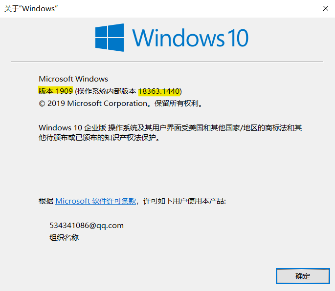

# 〇、本文阅读不完全指北

本文档由刘煜、李睿潇两名同学编写，基于两人在Windows系统下安装环境时的个人经历制作。

# 一、需要内容：

## 1.   检查Windows版本：

 “Windows + R”键开启“运行”，输入“winver”，查看您的Windows版本，这将是检查您的系统能否使用WSL（Windows Subsystem for Linux）功能的重要依据。



## 2.   以管理员身份打开命令行/Power shell

在本经验贴中，您往往会遇到需要一定权限才能使用的命令，这需要您以管理员身份启动命令行/Power shell；您可以通过“Windows + S”键启用搜索，输入“powershell”，在弹出界面中选择“以管理员身份启动”即可。命令行同理。

```
powershell
```


# 二、正式安装内容：

## 1.安装WSL2

 根据Windows版本的不同，WSL2有简易安装和手动安装两种模式。

简易安装需要您的Windows版本是预览版（OS版本20262或更高）且需要加入Windows预览体验计划。

 手动安装对于Windows的版本要求：

对于 x64 系统：**版本** **1903** 或更高版本，采用 **内部版本** **18362** 或更高版本。

对于 ARM64 系统：**版本** **2004** 或更高版本，采用 **内部版本** **19041** 或更高版本。

重要：请确保您使用的是Windows专业版，如不符合要求请更改版本（右键“此电脑”——“属性”——“更改产品密钥”）

#### 1）简易安装：

i）       确保Windows版本符合要求

ii）      以管理员身份开启命令行

iii）     输入wsl.exe --install

iv）     设置Linux分发版账户和密码

#### 2）手动安装：

##### i)          启用适用于 Linux 的 Windows 子系统：

以管理员身份打开 PowerShell 并运行（命令请在一行内输入）

```
dism.exe /online /enable-feature /featurename:Microsoft-Windows-Subsystem-Linux /all /norestart
```

##### ii)          启用虚拟机功能：

以管理员身份打开PowerShell并运行（命令请在一行内输入）

```
dism.exe /online /enable-feature /featurename:VirtualMachinePlatform /all /norestart
```

您也可以通过在设置中输入“启用或关闭Windows功能”，随后在对话框内勾选“适用于Linux的Windows子系统”和“虚拟机平台”两个选项。

##### iii)          下载WSL2升级包：

[wsl]: https://wslstorestorage.blob.core.windows.net/wslblob/wsl_update_x64.msi

点击链接下载并运行即可.

##### iv)          将WSL2设置为默认版本：

打开PowerShell，运行

```
wsl --set-default-version 2
```

##### v)          安装Ubuntu：

打开Microsoft Store（微软商店），搜索Ubuntu即可，等待下载完成自动安装；

完成后在Ubuntu命令行中设置账号及密码即可。

##### vi)		把Ubuntu的WSL版本从1改为2：

以管理员身份打开PowerShell，输入wsl --list –verbose， 查看版本。输入：

```
wsl --set-version ubuntu 2
```

## 2.安装Docker

Docker是一种工具，用于创建、部署和运行应用程序（通过Container）。这相当于一个个隔离沙箱，可以让每个container里的东西互不干扰。这听上去跟虚拟机类似，但是Docker比虚拟机轻量很多，能够让人更方便的进行开发。

#### 1）下载Docker

[docker]: https://docs.docker.com/docker-for-windows/wsl/#download

#### 2)   设置Docker

在docker中点击设置——general——use the WSL 2 based engine

点击设置——Resources——WSL INTERGRATION，启用你所使用的Ubuntu

（如果想确认Docker是否安装成功，可以在Ubuntu界面中输入wsl –version）

```
wsl –version
```


## 3.安装docker-compose

此部分将会教您安装docker-compose，并且会让您写出一个简易的docker-compose应用案例（网页）

####  1） 输入

 在Ubuntu中输入

```
sudo curl -L "https://github.com/docker/compose/releases/download/1.27.4/docker-compose-$(uname -s)-$(uname -m)" -o /usr/local/bin/docker-compose
```

（以上命令请在同一行中输入，其中的“1.27.4”为版本号，在您安装时请根据当时情况自行更改）

   随后请输入

```
sudo chmod +x /usr/local/bin/docker-compose
```

（成功后可以输入docker-compose --version）来检查版本

```
docker-compose --version
```

------

/*以下步骤为建立一个docker-compose的使用案例，如想要直接启动后端文件，请直接跳到下一节*/

#### 2） 建立一个docker-compose.yml文件

yml文件对于使用docker-compose十分重要。

##### i）       创建一个文件夹并移动到该路径，请在Ubuntu中输入

```
mkdir ~/compose-demo
```

```
cd ~/compose-demo
```

##### ii）       建立一个文件根目录，并且在其中加入html文件，编辑之

```
mkdir app
```

```
nano app/index.html
```

在index.html中输入：

```html
<!doctype html>
<html lang="en">
<head>
    <meta charset="utf-8">
    <title>Docker Compose Demo</title>
    <link rel="stylesheet" href="https://cdn.jsdelivr.net/gh/kognise/water.css@latest/dist/dark.min.css">
</head>
<body>

    <h1>This is a Docker Compose Demo Page.</h1>
    <p>This content is being served by a container.</p>

</body>
</html>

```

##### iii）       新建一个docker-compose.yml文件，编辑之

```
nano docker-compose.yml
```

然后在其中输入：

```yaml
version: '3.7'
services:
  web:
    image: nginx:alpine
    ports:
      - "8000:80"
    volumes:
      - ./app:/usr/share/nginx/html

```

##### iv）       启动docker compose

在Ubuntu中输入

```
docker-compose up -d
```

如果提示

Creating compose-demo_web_1 ... done

说明已经成功建立，此时去docker里边看已经可以发现一个正在运行的container

也可以使用

docker-compose ps 来查看现在正在运行的containers

```
docker-compose ps
```

在浏览器中输入“localhost：8000”即可看到网页！

```
localhost：8000
```

##### v）       也可以输入docker-compose来查看帮助

```
docker-compose
```

------


## 4.生成git access ssh token

#### 1） 生成SSH key并把它加入ssh-agent

i） 打开Ubuntu（Git Bash也行）输入：

```
ssh-keygen -t ed25519 -C "your_email@example.com"
```

 这将会生成一个新的SSH key，然后在弹出的储存key的界面回车保存key文件。再输入一个secure passphrase.

ii）把SSH key加入ssh-agent

​     还是在Ubuntu/Git Bash中输入：

```
eval `ssh-agent -s`
```

这会启动ssh-agent，然后输入：

```
ssh-add ~/.ssh/id_ed25519
```

 （如果你的key名字不太一样，请把id_ed25519改成在第一步中保存key时见到的名字）

####   2） 把新的SSH key加入你的Github账户

i）复制SSH key到剪切板

​     还是在Ubuntu/Git Bash中，输入

```
clip < ~/.ssh/id_ed25519.pub
```

 ii）把SSH key加入你的Github账号中：  

在Github中，点击头像进入settings，找到SSH and GPG keys选 项，点击New SSH key；输入一个title，在下方的key中黏贴刚才复制的SSH key。点击Add SSH key并输入GitHub密码即可。

## 5.克隆前后端代码到Ubuntu

在Ubuntu的目录里面，但是最好不要在/.ssh里面，找一个进去，执行下列命令（第一个是后端，第二个是前端）；如果太慢，建议换网。

```
git clone git@github.com:ichn-hu/today-backend.git 
```

```
git clone git@github.com:CLDXiang/today-frontend.git
```

是否成功见命令行提示。

现可找到today-backend和today-frontend两个文件夹，记其位置。

## 6.启动后端

后端的环境配置需要使用 docker 和 docker-compose 。后端会运行三个 docker: api, mysql, redis，而 docker-compose 可以把三个 docker 联合运行（省去手动启动三次）。

这里提前说一下成功标准，两条有一条就可以；成功了就去下一步吧。

```
1. 命令行最后一行出现含有 redis_1 | 和 时间 和 ready to accept connections 字样的输出
```

```
2.  访问localhost:8000，网页内容符合刚刚写入的html文件
```

打开docker客户端，setting->Resource->WSL Integration，把Ubuntu对应的开关打开。若该页面有未勾选的选项（一般没有），勾之。现在可以关掉docker。

构建 docker-compose，键入

```
docker-compose -f docker-compose-dev.yml build
```

运行 docker-compose，键入

```
docker-compose -f docker-compose-dev.yml up
```

输入以下命令显示 docker 正在运行的项目（这一命令也可以检验是否docker已经启动）

```
docker ps
```

进入 api 所在的 docker (从上一条命令中查看 today-backend_api 所对应的 container id )

```
docker exec -it 4cdbb6187be3 /bin/sh
```

进入容器后，所在目录为 /app，执行以下命令创建配置文件

```
cp ormconfig.json.example ormconfig.json
```

最后，执行下面的命令执行 migration

```
npx typeorm migration:run
```

## 7.看一看后端代码

首先保证Ubuntu在运行之中，直接打开vs code点击远程资源管理器。按你克隆的路径找一下就好。

在Ubuntu启动的情况下，可以在资源管理器目录处键入

```
\\wsl$
```

直接访问Ubuntu，基本为所欲为。

## 8.启动前端

提前说一下成功标准：命令行提示可以使用两个ip地址访问前端，一个是

```
localhost:8080
```

另一个是公网ip，因人而异。浏览器网址栏输入任一ip，出现如下页面即可。（课表）


具体操作的第一步需要回到Ubuntu里使用cd命令前往today-frontend文件夹，进入后键入

```
yarn （或yarn install）
```

之后键入运行命令

```
yarn dev
```

# 三、独立重复实验：

如果成功了请重启电脑，再来一遍：

启动docker。启动Ubuntu，进入docker的文件夹

```
cd ~/docker-composed/
```

键入下面的命令启动后端

```
docker-compose -f docker-compose-dev.yml up
```

观察是否成功。另打开一个Ubuntu终端，进入today-frontend文件夹，输入

```
yarn dev
```

启动前端，观察是否成功。如果都成功了，恭喜你，打开了新世界的大门~

# 四、可能出现的问题：

## 网络、下载不了

下载报错、卡死，也有可能单纯是网络问题，重试或者换一个网都可以。

也可以开启代理：首先使用以下命令来查看命令行连接公网的 ip 地址，可以 google 一下 where is + ip 来查看ip所在的位置，一般就是杨浦。

```
curl ip.sb
```

使用以下命令在命令行中开启代理（127.0.0.1:1087为本地的代理端口，在你的电脑上可能不同）

```
export http_proxy=http://127.0.0.1:1087;
export https_proxy=http://127.0.0.1:1087;
```

如果没有用，记得换回来！！

## 在使用PowerShell时候提示权限不足

请参阅一开始的用管理员身份打开命令行/PowerShell

## Redis没有密码

报错信息的中文意思大概是redis不需要密码但是你提供了一个。先不要做什么动作；如果确定卡死，就重开。

## 后端使用命令行启动不了

重开，并注意docker客户端而不是命令行的报错信息；如果docker客户端没有任何问题，即手动开启后端可以成功使其运行、localhost:8000网页内容符合刚刚写入的html文件，则建议从docker手动开启那三个程序。给人增添烦恼的手续，回避掉也不失为一种方法！

## Docker客户端报错（找不到文件）

这里讲的报错是restart失败之后会出现的一个弹窗；至于让你提交错误信息，不要理会。

一般在前几行有核心提示，没有必要再浪费时间看后面。提示是文件找不到了（具体的文件五花八门），那请你帮docker在电脑里搜索一下；如果确实没了那就更新一下docker（右键任务栏的docker图标，选择“检查更新”，有更新就用，没有的话可以等），谁还没有流氓的时候呢。

## 配置前/后端时输入命令没有反应

首先，没有$符号就不要输入命令。

配置前后端成功，意味着一直有线程在运行，无法输入命令。这时唯一有响应的是ctrl+c强制终止（ctrl+z没有用）。其余情况请等待，下载不下来最好换网，这样比较快。

执着要命令，就另开一个窗口。

## 键入某些命令不识别

命令行会提示没有这个命令。如果是yarn或npm命令，请看后面。其他情况，请从各种渠道寻求帮助，总之不要信命令行的提示。

##  键入yarn不识别

首先尝试键入

```
sudo apt update
sudo apt install curl
curl -sS https://dl.yarnpkg.com/debian/pubkey.gpg | sudo apt-key add -
echo "deb https://dl.yarnpkg.com/debian/ stable main" | sudo tee /etc/apt/sources.list.d/yarn.list
sudo apt update
sudo apt install yarn
```

之后进入today-frontend文件夹，再次尝试

```
yarn （或yarn install）
```

没有报错即成功；如果提示node版本过低（node就是nodejs），请留意所需版本号。键入

```
sudo apt upgrade nodejs
```

尝试更新node，版本号达到就算成功，可以键入yarn了。如果版本依旧不行，键入

```
npm update -g
```

更新npm。npm是一个比较关键的应用，因此我们选择这一方法更新node，顺便摸清npm的情况。如果根本就没有npm（会提示没有npm这个命令，即不识别这个命令），直接用apt-get命令装一个npm:

```
sudo apt-get install npm
```

之后用apt-get把nodejs卸掉:

```
sudo apt-get remove nodejs
```

使用npm装一个nodejs

```
npm install -g n 
n latest
```

记住安装成功的界面上nodejs的路径。用

```
nodejs –-version
```

查看版本，如果没有反应，请将刚刚的目录添加到Ubuntu的环境变量里去。版本号够了，就返回到today-frontend文件夹，再次尝试

```
yarn （或yarn install）
```

其实解决办法有很多种，比如可自己下一个nodejs，不过记得检查npm。

## 环境变量

方法很多，所以这里推荐上网搜索，按需自取。环境变量可用

```
$PATH
```

命令查看。如需编辑文件，推荐仿前面的步骤，使用nano编辑。