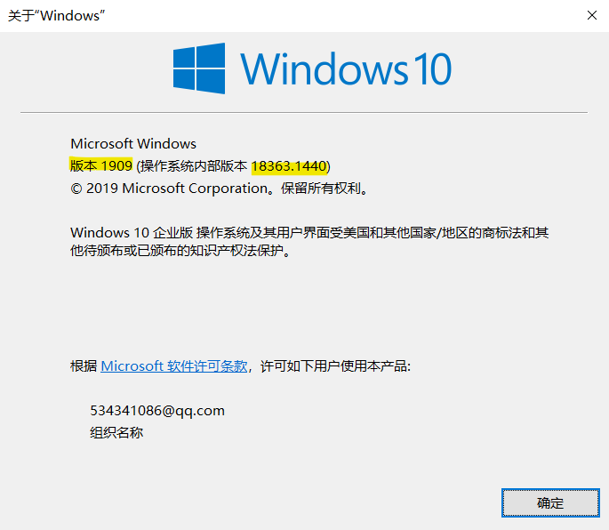
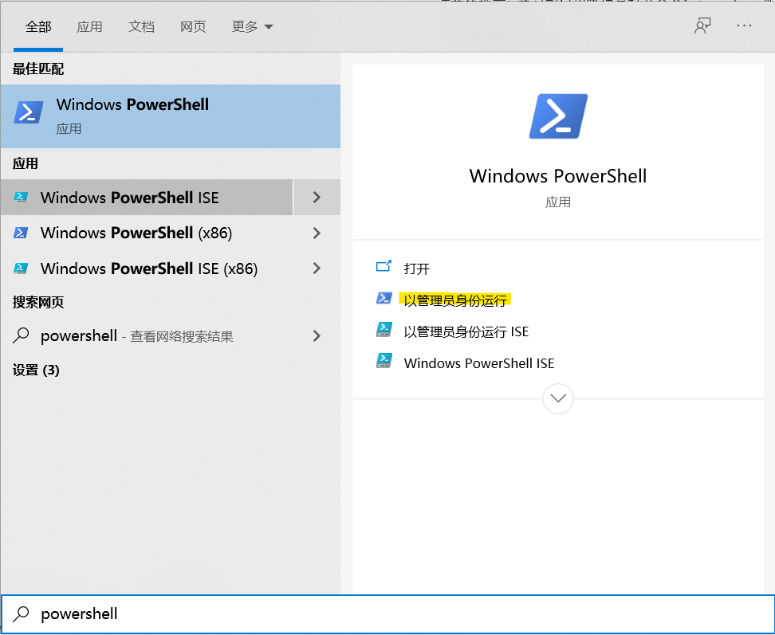
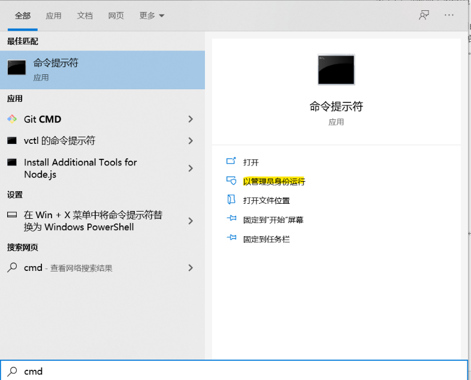
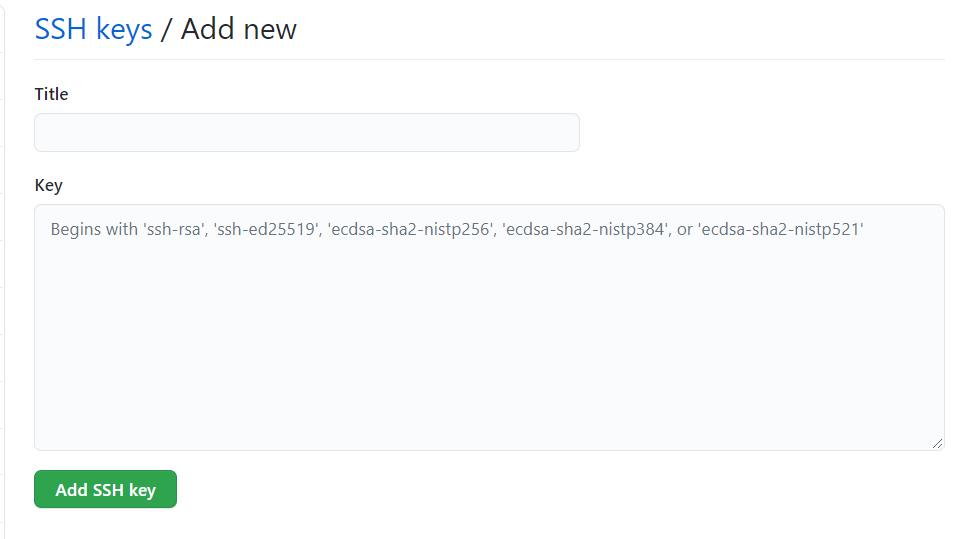

# fdxk.info 后端开发在 win10 上的配置

####  目录

- 简介


- 准备工作


- 正式安装内容


- 独立重复实验


- 可能遇到的问题


# 简介

#### 什么是 [fdxk.info](https://cslg.info/blog/2021-03-07-fdxk-env-config/fdxk.info)[¶](https://cslg.info/blog/2021-03-07-fdxk-env-config/#fdxkinfo)

[fdxk.info](https://cslg.info/blog/2021-03-07-fdxk-env-config/fdxk.info) (Fudan Xuan Ke Info) 是 FDUCSLG（Fudan Unniversity Computer Science Lovers Group）旗下的网站，由复旦大学的计算机相关专业的技术爱好者们开发和维护，旨在解决复旦缺少校内信息交流渠道的问题。

至于这个项目有多 amazing ，欢迎直接点进去看看~

目前积极开发，进展良好，士气正盛。同人于野，利涉大川。如果你对此感兴趣，欢迎联系我们！

#### 关于这篇文章

本文档由刘煜、李睿潇两名同学编写，基于两人在 Windows 系统下安装 fdxk 的开发环境时的个人经历制作。写下这篇文章，一方面是以后的开发中可以作为速查，一方面也是方便以后的同学配置开发环境。

```typescript
" 感谢胡志峰学长(https://github.com/ichn-hu) 的指导和李叔禄(https://github.com/Depetrol)的支持！感谢！" * 10086
```

!!! note
    " 感谢胡志峰学长(https://github.com/ichn-hu) 的指导和李叔禄(https://github.com/Depetrol)的支持！感谢！" * 10086


# 准备工作： 

## 检查 Windows 版本：

 `Windows + R` 键开启“运行”，输入 `winver`，查看您的 Windows 版本，这将是检查您的系统能否使用 WSL（Windows Subsystem for Linux）功能的重要依据。



## 以管理员身份打开命令行 / Power shell

在本经验贴中，您往往会遇到需要一定权限才能使用的命令，这需要您以管理员身份启动命令行 / `Power shell`；您可以通过 `Windows + S` 键启用搜索，输入 `powershell` ，在弹出界面中选择“**以管理员身份启动**”即可。命令行同理。





# 正式安装内容：

## 安装 WSL2

根据 Windows 版本的不同，WSL2 有简易安装和手动安装两种模式。

简易安装需要您的 Windows 版本是预览版（OS 版本20262或更高）且需要加入 Windows 预览体验计划。

手动安装对于 Windows 的版本要求：

对于 x86-64 系统：**版本** **1903** 或更高版本，采用 **内部版本** **18362** 或更高版本。

对于 ARM64 系统：**版本** **2004** 或更高版本，采用 **内部版本** **19041** 或更高版本。

重要：请确保您使用的是 Windows 专业版，如不符合要求请更改版本（右键“此电脑”——“属性”——“更改产品密钥”）

- 简易安装：

确保 Windows 版本符合要求

以管理员身份开启命令行

输入`wsl.exe --install`

设置 Linux 分发版账户和密码

- 手动安装：

##### 启用适用于 Linux 的 Windows 子系统：

以管理员身份打开 PowerShell 并运行（命令请在一行内输入）

```
dism.exe /online /enable-feature /featurename:Microsoft-Windows-Subsystem-Linux /all /norestart
```

##### 启用虚拟机功能：

以管理员身份打开PowerShell并运行（命令请在一行内输入）

```
dism.exe /online /enable-feature /featurename:VirtualMachinePlatform /all /norestart
```

您也可以通过在设置中输入“启用或关闭 Windows 功能”，随后在对话框内勾选“适用于 Linux 的 Windows 子系统”和“虚拟机平台”两个选项。

##### 下载 WSL2 升级包：

点击[链接](https://wslstorestorage.blob.core.windows.net/wslblob/wsl_update_x64.msi)下载并运行即可.

##### 将 WSL2 设置为默认版本：

打开PowerShell，运行

```
wsl --set-default-version 2
```

##### 安装 Ubuntu：

打开 Microsoft Store（微软商店），搜索 Ubuntu 即可，等待下载完成自动安装；

完成后在 Ubuntu 命令行中设置账号及密码即可。

##### 把 Ubuntu 的 WSL 版本从1改为2：

以管理员身份打开 PowerShell ，输入`wsl --list –verbose`， 查看版本。

输入：

```
wsl --set-version ubuntu 2
```

## 安装Docker

Docker 是一种工具，用于创建、部署和运行应用程序（通过 Container）。这相当于一个个隔离沙箱，可以让每个 container 里的东西互不干扰。这听上去跟虚拟机类似，但是 Docker 比虚拟机轻量很多，能够让人更方便的进行开发。

#### 下载Docker

[下载链接](https://docs.docker.com/docker-for-windows/wsl/#download )

#### 设置Docker

在 Docker 中点击设置——general——use the WSL 2 based engine

点击设置——Resources——WSL INTERGRATION，启用你所使用的 Ubuntu

（如果想确认 Docker 是否安装成功，可以在Ubuntu界面中输入`wsl –version`）

## 安装docker-compose

此部分将会教您安装 `docker-compose`，并且会让您写出一个简易的 docker-compose 应用案例（网页）

####  输入

 在 Ubuntu 中输入

```
sudo curl -L "https://github.com/docker/compose/releases/download/1.27.4/docker-compose-$(uname -s)-$(uname -m)" -o /usr/local/bin/docker-compose
```

（以上命令请在同一行中输入，其中的“1.27.4”为版本号，在您安装时请根据当时情况自行更改）

   随后请输入

```
sudo chmod +x /usr/local/bin/docker-compose
```

（成功后可以输入 `docker-compose --version`）来检查版本

------

*以下步骤为建立一个 docker-compose 的使用案例，如想要直接启动后端文件，请直接跳到下一节*

#### 建立一个 docker-compose.yml 文件

yml 文件对于使用 docker-compose 十分重要。

##### 创建一个文件夹并移动到该路径，请在 Ubuntu 中输入

```
mkdir ~/compose-demo
```

```
cd ~/compose-demo
```

##### 建立一个文件根目录，并且在其中加入 html 文件，编辑之

```
mkdir app
```

```
nano app/index.html
```

在 index.html 中输入：

```html
<!doctype html>
<html lang="en">
<head>
    <meta charset="utf-8">
    <title>Docker Compose Demo</title>
    <link rel="stylesheet" href="https://cdn.jsdelivr.net/gh/kognise/water.css@latest/dist/dark.min.css">
</head>
<body>

    <h1>This is a Docker Compose Demo Page.</h1>
    <p>This content is being served by a container.</p>

</body>
</html>

```

##### 新建一个 docker-compose.yml 文件，编辑之

```
nano docker-compose.yml
```

然后在其中输入：

```yaml
version: '3.7'
services:
  web:
    image: nginx:alpine
    ports:
      - "8000:80"
    volumes:
      - ./app:/usr/share/nginx/html

```

##### 启动 docker compose

在 Ubuntu 中输入

```
docker-compose up -d
```

如果提示

Creating compose-demo_web_1 ... done

说明已经成功建立，此时去 docker 里边看已经可以发现一个正在运行的 container

也可以使用

`docker-compose ps` 来查看现在正在运行的 containers

在浏览器中输入`localhost：8000`即可看到网页！

##### 也可以输入`docker-compose`来查看帮助

```
docker-compose
```

------

## 生成 git access ssh token

#### 生成 SSH key 并把它加入 ssh-agent

- 打开 Ubuntu（Git Bash 也行）输入：

```
ssh-keygen -t ed25519 -C "your_email@example.com"
```
 其中 ed25519 是指定的 key 名称，你可以任意指定自己想用的名称，并把后文中出现的 ed25519 替换成你指定的。

 这将会生成一个新的 SSH key，然后在弹出的储存 key 的界面回车保存 key 文件，再随机输入一个 secure passphrase，这里也可以留空直接按回车键。

- 把SSH key加入ssh-agent

还是在Ubuntu/Git Bash中输入：

```
eval `ssh-agent -s`
```

这会启动ssh-agent，然后输入：

```
ssh-add ~/.ssh/id_ed25519
```

 （如果你的 key 名字不太一样，请把 id_ed25519 改成在第一步中保存 key 时见到的名字）

#### 把新的 SSH key 加入到你的 Github 账户

- 复制 SSH key 到剪切板


还是在 Ubuntu/Git Bash 中，输入

```
clip < ~/.ssh/id_ed25519.pub
```

- 把 SSH key 加入你的 Github 账号中：  

在 Github 中，点击头像进入 settings，找到 SSH and GPG keys 选项，点击 New SSH key；输入一个title，在下方的 key 中黏贴刚才复制的 SSH key。点击 Add SSH key 并输入 GitHub 密码即可。



## 克隆前后端代码到 Ubuntu

在 Ubuntu 的 home 目录下新建一个工作目录，名字任取但建议不要带空格（如 `Projects`、`MyProjects` 等等），进去后，执行下列命令从 GitHub 上获取前后端代码（第一个是后端，第二个是前端）；如果太慢，建议换网或开启代理。

!!! warning
    目前 fdxk.info 的代码尚未开源，因此你需要提前联系我们获得代码仓库的访问权限。前端代码考虑在未来两三个月左右开源，但后端代码出于安全考虑，可能会放缓开源计划，但任然敬请期待。

```
git clone git@github.com:ichn-hu/today-backend.git 
```

```
git clone git@github.com:CLDXiang/today-frontend.git
```

是否成功见命令行提示。

现可找到 today-backend 和 today-frontend 两个文件夹，记其位置。

## 启动后端

后端的环境配置需要使用 docker 和 docker-compose 。后端会运行三个 docker: api, mysql, redis，而 docker-compose 可以把三个 docker 联合运行（省去手动启动三次）。

这里提前说一下成功标准，两条有一条就可以；成功了就去下一步吧。

1. 命令行最后一行出现含有 redis_1 | 和 时间 和 ready to accept connections 字样的输出
2.  访问localhost:8000，网页内容符合刚刚写入的html文件

打开docker客户端，setting->Resource->WSL Integration，把 Ubuntu 对应的开关打开。若该页面有未勾选的选项（一般没有），勾之。现在可以关掉 docker。

构建 docker-compose，键入

```
docker-compose -f docker-compose-dev.yml build
```

运行 docker-compose，键入

```
docker-compose -f docker-compose-dev.yml up
```

输入以下命令显示 docker 正在运行的项目（这一命令也可以检验是否 docker 已经启动）

```
docker ps
```

进入 api 所在的 docker (从上一条命令中查看 today-backend_api 所对应的 container id )

```
docker exec -it 4cdbb6187be3 /bin/sh
```

进入容器后，所在目录为 /app，执行以下命令创建配置文件

```
cp ormconfig.json.example ormconfig.json
```

最后，执行下面的命令执行 migration

```
npx typeorm migration:run
```

## 看一看后端代码

首先保证 Ubuntu 在运行之中，直接打开 vs code 点击远程资源管理器。按你克隆的路径找一下就好。

在 Ubuntu 启动的情况下，可以在资源管理器目录处键入`\\wsl$`

直接访问Ubuntu，基本为所欲为。

## 启动前端

提前说一下成功标准：命令行提示可以使用两个 ip 地址访问前端，一个是

```
localhost:8080
```

另一个是公网ip，因人而异。浏览器网址栏输入任一 ip，出现如下页面即可。（课表）


具体操作的第一步需要回到 Ubuntu 里使用 cd 命令前往 today-frontend 文件夹，进入后键入

```
yarn （或yarn install）
```

之后键入运行命令

```
yarn dev
```

# 独立重复实验：

如果成功了请重启电脑，再来一遍：

启动 docker。启动 Ubuntu，进入 docker 的文件夹

```
cd ~/docker-composed/
```

键入下面的命令启动后端

```
docker-compose -f docker-compose-dev.yml up
```

观察是否成功。另打开一个 Ubuntu 终端，进入 today-frontend 文件夹，输入

```
yarn dev
```

启动前端，观察是否成功。如果都成功了，恭喜你，打开了新世界的大门~

# 可能出现的问题：

## 网络、下载不了

下载报错、卡死，也有可能单纯是网络问题，重试或者换一个网都可以。

也可以开启代理：首先使用以下命令来查看命令行连接公网的 ip 地址，可以 google 一下 where is + ip 来查看ip所在的位置，一般就是杨浦。

```
curl ip.sb
```

使用以下命令在命令行中开启代理（127.0.0.1:1087为本地的代理端口，在你的电脑上可能不同）

```
export http_proxy=http://127.0.0.1:1087;
export https_proxy=http://127.0.0.1:1087;
```

如果没有用，记得换回来！！

## 在使用 PowerShell 时候提示权限不足

请参阅一开始的用管理员身份打开命令行/PowerShell

## Redis 没有密码

报错信息的中文意思大概是 redis 不需要密码但是你提供了一个。先不要做什么动作；如果确定卡死，就重开。

## 后端使用命令行启动不了

重开，并注意 docker 客户端而不是命令行的报错信息；如果 docker 客户端没有任何问题，即手动开启后端可以成功使其运行、localhost:8000 网页内容符合刚刚写入的 html 文件，则建议从 docker 手动开启那三个程序。给人增添烦恼的手续，回避掉也不失为一种方法！

## Docker 客户端报错（找不到文件）

这里讲的报错是 restart 失败之后会出现的一个弹窗；至于让你提交错误信息，不要理会。

一般在前几行有核心提示，没有必要再浪费时间看后面。提示是文件找不到了（具体的文件五花八门），那请你帮 docker 在电脑里搜索一下；如果确实没了那就更新一下 docker（右键任务栏的 docker 图标，选择“检查更新”，有更新就用，没有的话可以等），谁还没有流氓的时候呢。

## 配置前/后端时输入命令没有反应

首先，没有 $ 符号就不要输入命令。

配置前后端成功，意味着一直有线程在运行，无法输入命令。这时唯一有响应的是 ctrl+c 强制终止（ctrl+z 没有用）。其余情况请等待，下载不下来最好换网，这样比较快。

执着要命令，就另开一个窗口。

## 键入某些命令不识别

命令行会提示没有这个命令。如果是 yarn 或 npm 命令，请看后面。其他情况，请从各种渠道寻求帮助，总之不要信命令行的提示。

##  键入 yarn 不识别

首先尝试键入

```
sudo apt update
sudo apt install curl
curl -sS https://dl.yarnpkg.com/debian/pubkey.gpg | sudo apt-key add -
echo "deb https://dl.yarnpkg.com/debian/ stable main" | sudo tee /etc/apt/sources.list.d/yarn.list
sudo apt update
sudo apt install yarn
```

之后进入 today-frontend 文件夹，再次尝试

```
yarn （或yarn install）
```

没有报错即成功；如果提示 node 版本过低（node 就是 nodejs），请留意所需版本号。键入

```
sudo apt upgrade nodejs
```

尝试更新 node，版本号达到就算成功，可以键入 yarn 了。如果版本依旧不行，键入

```
npm update -g
```

更新 npm。npm 是一个比较关键的应用，因此我们选择这一方法更新 node，顺便摸清 npm 的情况。如果根本就没有 npm（会提示没有 npm 这个命令，即不识别这个命令），直接用 apt-get 命令装一个 npm:

```
sudo apt-get install npm
```

之后用 apt-get 把 nodejs 卸掉:

```
sudo apt-get remove nodejs
```

使用 npm 装一个 nodejs

```
npm install -g n 
n latest
```

记住安装成功的界面上 nodejs 的路径。用

```
nodejs –-version
```

查看版本，如果没有反应，请将刚刚的目录添加到 Ubuntu 的环境变量里去。版本号够了，就返回到today-frontend 文件夹，再次尝试

```
yarn （或yarn install）
```

其实解决办法有很多种，比如可自己下一个 nodejs，不过记得检查 npm。

## 环境变量

方法很多，所以这里推荐上网搜索，按需自取。环境变量可用

```
$PATH
```

命令查看。如需编辑文件，推荐仿前面的步骤，使用 nano 编辑。
